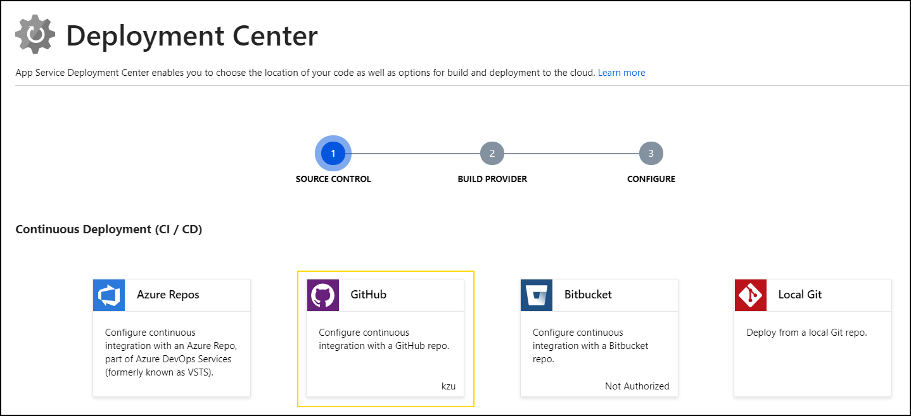
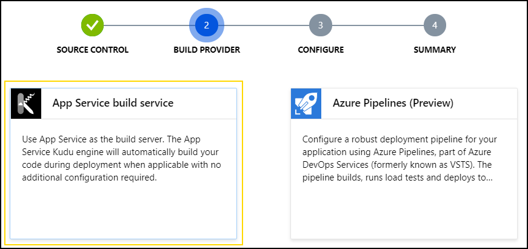
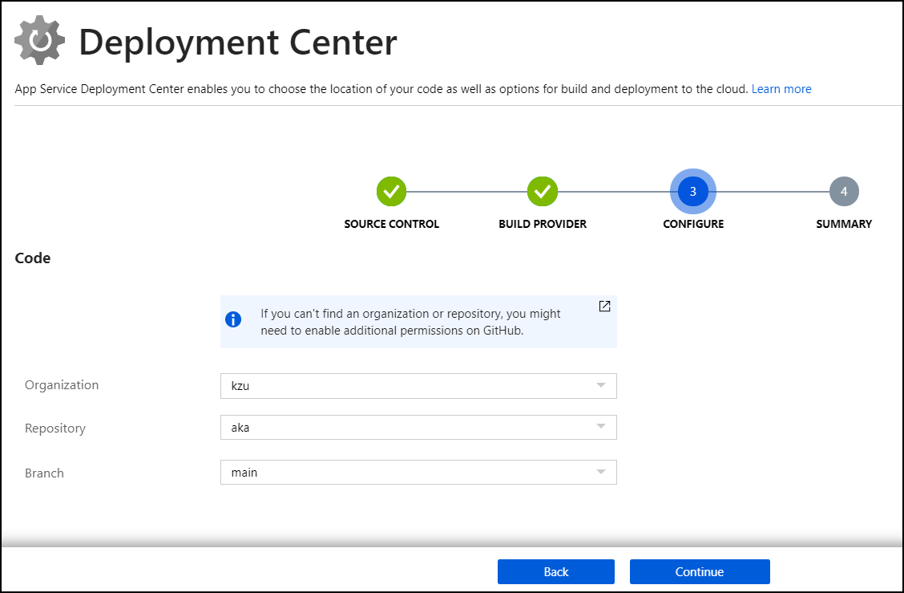
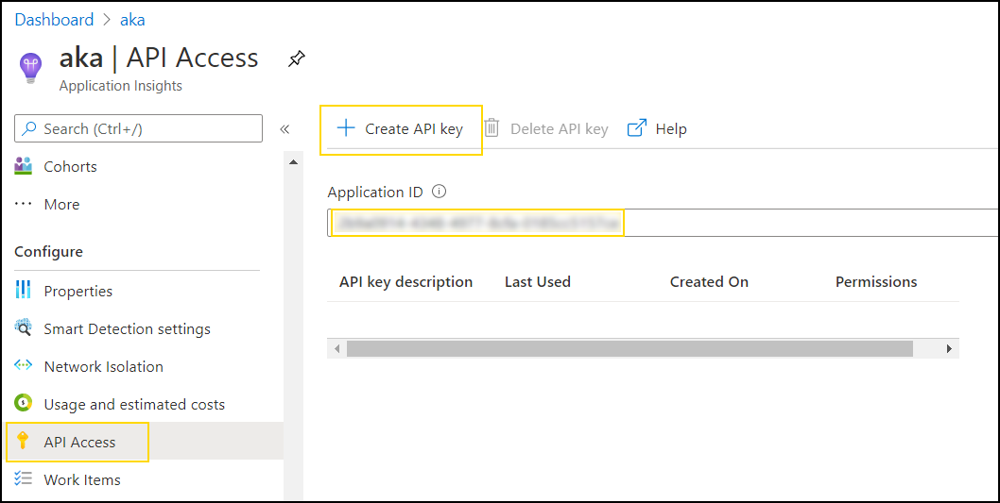

A few years back, while working on some DevOps-related tasks for Xamarin, 
I needed to create permalinks to CI/build artifacts so that other build 
pipelines (as well as local builds) could consume those regardless of the 
CI system that produced them (we had a mixture, so this complicated things). 

Every CI system typically already provides a way to access build artifacts, 
but it's frequently not very automation-friendly: it may be behind authentication, 
may not have easily constructable URLs, or may not correlate at all with the 
commit/sha being built. Another CI that needs to pick up those artifacts will 
have a hard time figuring out what "build ID" (say) to use to construct the 
URL to download stuff.

So I had the idea of using the https://aka.ms service that's already in use 
across Microsoft for various redirection needs. There was a lenghty and complicated 
registration, approval, periodic renewal and what-not involved, so while all 
that got sorted out, I took a shot at having something working quickly that I 
could later replace with the official service.

It turned out to be so incredibly easy that I think it should just be a (rather 
cool) sample on how to use Azure functions + (table) storage in a real-world 
yet easily comprehensible (and useful!) scenario.

## How It Works

Basically, the service consists of:

1. Azure (Table) Storage: a table holds the shortlink > target URL mapping
2. Azure Function: binds to that table, and redirects. In addition, provides 
   `POST/PUT` support for creating the links (with shared secret auth).

In addition, to make the sample incredible simple, I leveraged the `.csx` 
script-based function support, so the entire thing can be edited in VSCode 
trivially.

> NOTE: go [fork](https://github.com/kzu/aka) the repo first.

You will notice there is no project file, no CI settings, nothing. It's the 
most minimalistic Azure functions service *ever* 😁. Turns out that you can 
totally (automatically) deploy an azure service from basically a loose folder 
containing at least the `host.json` file in there and the Azure functions 
runtime will happily lookup declared functions in subfolders.

Before we get into deployment, though, let's see what the code does.

1. The [hosts.json](https://github.com/kzu/aka/blob/main/host.json) declares
   the version, extension bundle (needed because we bind to Azure storage) 
   and we added the `http` section so that we can use the shortlink URLs with 
   no prefix whatesoever (after the base URL):

    ```json
    {
      "$schema": "http://json.schemastore.org/host",
      "version": "2.0",
      "extensions": {
        "http": {
          "routePrefix": ""
        }
      },
      "extensionBundle": {
        "id": "Microsoft.Azure.Functions.ExtensionBundle",
        "version": "[1.*, 2.0.0)"
      }
    }
    ```

2. The URLs will look like `[FUNCTION_URL]/[SHORT_ALIAS]`, meaning we want 
   to map *all* incoming "paths" to the same function. This is accomplished 
   with the [proxies.json](https://github.com/kzu/aka/blob/main/proxies.json)

    ```json
    {
        "$schema": "http://json.schemastore.org/proxies",
        "proxies": {
            "buildproxy": {
                "matchCondition": {
                    "route": "{*alias}"
                },
                "backendUri": "https://localhost/aka/{alias}"
            }
        }
    }
    ```

   By convention, but also to avoid infinite redirection, we do use the 
   function folder/name in the backend URI, which is defined next.

3. The function definition specifies the route and the bindings in 
   [function.json](https://github.com/kzu/aka/blob/main/aka/function.json):

    ```json
    {
      "bindings": [
        {
          "authLevel": "anonymous",
          "name": "req",
          "type": "httpTrigger",
          "direction": "in",
          "methods": [ "get", "head", "post", "put" ],
          "route": "aka/{alias}"
        },
        {
          "type": "table",
          "name": "aka",
          "tableName": "Aka",
          "partitionKey": "aka",
          "rowKey": "{alias}",
          "take": 1,
          "connection": "AzureWebJobsStorage",
          "direction": "in"
        },
        {
          "type": "table",
          "name": "output",
          "tableName": "Aka",
          "connection": "AzureWebJobsStorage",
          "direction": "out"
        },
        {
          "name": "$return",
          "type": "http",
          "direction": "out"
        }    
      ],
      "disabled": false
    }
    ```

   Note the `"route": "aka/{alias}"`, which matches the `backendUri` specified 
   earlier.
   
   For the table binding, we use a fixed `Aka` table name and `aka` partition 
   key, since we only vary the mapping by the short name, which will be the 
   row key for the table entries. You could change which connection string 
   to use here too, but for simplificy, I'm just using the same as the function 
   app itself. 

4. Finally, the function code is quite trivial too, defined in 
   [run.csx](https://github.com/kzu/aka/blob/main/aka/run.csx):

    ```csharp
    static readonly string authorization = Environment.GetEnvironmentVariable("X-Authorization");

    public static IActionResult Run(HttpRequest req, Aka aka, ILogger log, out Aka output, string alias = "400")
    {
        log.LogInformation($"alias={alias}, PK={aka?.PartitionKey}, RK={aka?.RowKey}, Url={aka?.Url}");

        output = default;

        if (alias == "400" || string.IsNullOrEmpty(alias))
            return new BadRequestResult();

        // Create
        if (req.Method == "POST" || req.Method == "PUT")
        {
            if (req.Headers.TryGetValue("X-Authorization", out var values) && 
                values.FirstOrDefault() == authorization)
            {
                using (var reader = new StreamReader(req.Body))
                {
                    var url = reader.ReadToEnd();
                    if (aka != null)
                        aka.Url = url;
                    else
                        aka = new Aka { RowKey = alias, Url = url }; 

                    output = aka;
                    return new RedirectResult(url);
                }    
            }
            else
            {
                return new UnauthorizedResult();
            }
        }

        if (aka == null)
            return new NotFoundResult();

        return new RedirectResult(aka.Url);
    }
    ```

   Notable points here are:

   * The alias may be empty (may be user error) and that causes a 400 Bad Request response.
   * If the verb is POST/PUT, we check for an `X-Authorization` header that must match the 
     one configured for the app. Note how we either update the `aka` parameter (automatically 
     bound from Azure storage if the record was found) or we create a new one. 
   * To persist changes to the table, we just assign the output to the `aka` variable, which 
     would result in an update or a new entry automatically.

5. To enable the "upsert" behavior (update or insert as necessary), the `Aka` class is defined 
   as follows (in the same [run.csx](https://github.com/kzu/aka/blob/main/aka/run.csx#L53-L70)): 

    ```csharp
    public class Aka
    {
        string rowKey = "400";

        public string PartitionKey { get; set; } = "aka";
        public string RowKey 
        { 
            get => rowKey;
            set 
            {
                if (!string.IsNullOrEmpty(value))
                    rowKey = value;  
            }
        }

        public string Url { get; set; }
        public string ETag { get; } = "*";
    }
    ```

   The `ETag` property is the one that allows the returned object to be considered an 
   update to the existing one. Note also how we're only setting the `RowKey` if it has 
   a valid value, since otherwise Azure storage would fail to bind with an error, instead 
   of a "not found" result. In combination with the parameter defaulting, we cover both 
   bases :). 


## Deployment

The simplest possible deployment for a simple app like this is to directly deploy 
from GitHub using App Service:



After connecting your GitHub account as needed, pick the *App Service build service*
next:



Finally, connect select the right org/repo/branch for the source. In my case, it looks 
like the following:




> NOTE: if your `hosts.json` is not in the root of the repository, you can still 
> deploy using this service by setting the `DEPLOYMENT_SOURCE` application setting 
> with the relative path to the folder to deploy, such as `.\api`. 


Once deployed, you can simply use curl to create the shortlinks, i.e.:

```
> curl -i -d https://github.com/kzu/aka -H "X-Authorization: ****" https://aka.azurewebsites.net/aka
HTTP/1.1 302 Found
Location: https://github.com/kzu/aka

❯ curl -i https://aka.azurewebsites.net/aka
HTTP/1.1 302 Found
Location: https://github.com/kzu/aka
```

## Notes

* You can of course ignore the `X-Authorization` custom header I made up and 
  just use the regular functions runtime authentication too

* This very same service powers my own https://aka.kzu.io :) 

* You can easily query analytics for your redirections, like I do in [azdo](https://github.com/devlooped/azdo/blob/main/api/redirect/run.csx), 
  and easily turn those into badges via https://shields.io/endpoint. See example redirection [stats](https://github.com/kzu/aka/blob/main/stats/run.csx) badge:
  
  

  To set it up, create an API key to access your AppInsights account programmatically:
  
  
  
  And configure it as `APPINSIGHTS_APIKEY`, alongside `APPINSIGHTS_APPID` in the function app settings.


Pretty powerful and flexible stuff with so few lines of code... gotta love serverless :)