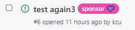

> TLDR: just go check [sponsors.yml](https://github.com/devlooped/.github/blob/main/.github/workflows/sponsors.yml) and [sponsors.ps1](https://github.com/devlooped/.github/blob/main/.github/workflows/sponsors.ps1) 😉

For my new [GitHub organization](https://github.com/devlooped) (which I had to set up alongside an LLC to actually be able to be [sponsored](https://github.com/sponsors/devlooped)!), I want to automatically label issues and PRs depending on whether the author is a sponsor. Easy enough, just [use a readily available action in the marketplace](https://github.com/marketplace/actions/sponsor-labels)!

It does the basics, and applies a label you can even configure:

```yml
  - uses: JasonEtco/is-sponsor-label-action@v1
    with:
      label: Sponsor ❤️
    env:
      GITHUB_TOKEN: ${{ secrets.GITHUB_TOKEN }}
```

Right up-front, I faced the first limitation: I want the label to have a certain color, of course!



Off to forking the project (gotta love OSS!) and [poking around until it sorta works](https://github.com/JasonEtco/is-sponsor-label-action/compare/main...kzu:main) :). Oh, and I want to have *two* labels, one slightly different for "power sponsors". Sigh, more tweaking Javascript??

At that point, after having tweaked the code here and there, it dawned on me it's all HTTP requests to the GitHub API in the end. Why did I need all this in the first place then?

## Back to Basics

GitHub Actions are super powerful, and now that we have a [consistent, cross-platform scripting language](https://github.com/powershell/powershell), there's really no reason not to just write a bit of PowerShell scripting to get *precisely* what you want. PowerShell comes built-in in all [GitHub Actions Virtual Environments](https://github.com/actions/virtual-environments). From the readme you can go inspect all built-in software, and [Ubuntu](https://github.com/actions/virtual-environments/blob/main/images/linux/Ubuntu2004-README.md#powershell-tools), [macOS](https://github.com/actions/virtual-environments/blob/main/images/macos/macos-11.0-Readme.md#powershell-tools) and [Windows](https://github.com/actions/virtual-environments/blob/main/images/win/Windows2019-Readme.md#powershell-tools) all come with the same PowerShell 7.1.x (at the time of this writing). 

How do you run PowerShell in all three OSes? Easy!

```yml
jobs:
  sponsors:
    runs-on: ubuntu-latest
    steps:
      - name: 🤘 checkout
        uses: actions/checkout@v2

      - name: 💛 sponsors
        shell: pwsh
        run: ./.github/workflows/sponsors.ps1
        env:
          GH_TOKEN: ${{ secrets.DEVLOOPED_TOKEN }}
```

Note the `shell: pwsh` in the step. That's all you need! You can also change the default shell for all steps in your workflow by placing this at the top instead:

```yml
defaults:
  run:
    shell: pwsh
```

To run that same script in another OS, just change `runs-on` to `windows-latest` or `macos-latest`. No changes whatesoever to the script!

Note also that I'm running a script *file*, using `run: ./.github/workflows/sponsors.ps1`, rather than placing all the script inline. For small-ish (say ~10 LoC script) it makes sense, but for longer scripts, the added ability to quickly test and run the script locally until it's perfect, is far better for non-trivial scripts.

## Using GitHub CLI

The essential part of the task (detecting if a user is a sponsor) is a bit non-trivial and involves ([in the original GitHub action](https://github.com/JasonEtco/is-sponsor-label-action/blob/main/lib/user-is-sponsor.js#L15-L56) I found) recursively running a [GraphQL query](https://docs.github.com/en/graphql) against GitHub. That was going to make for some unsightly PowerShell code. Fortunately, there is an awesome little-known tool from GitHub that provides a [full-blown CLI for almost everything](https://cli.github.com/manual/)! 

This combination of scripts plus small purpose-specific CLIs makes for very convenient CI/CD automation. I use that for (say) [installing Visual Studio Previews on hosted agents](https://www.cazzulino.com/vs-preview-ci.html) with [dotnet-vs](https://github.com/devlooped/dotnet-vs), for example. dotnet global tools are awesome for that sort of thing. 

So the GH CLI API I'll use is the one that runs *graphql*:

```ps
$query = gh api graphql --paginate -f owner='devlooped' -f query='
query($owner:  String!, $endCursor: String) {
  organization (login: $owner) {
    sponsorshipsAsMaintainer (first: 100, after: $endCursor) {
      nodes { 
        sponsorEntity {
          ... on Organization { id, name }
          ... on User { id, name }
        }
        tier { monthlyPriceInDollars }
      }
      pageInfo {
        hasNextPage
        endCursor
      }
    }
  }
}
'
```

The query is [almost the same as the original](https://github.com/JasonEtco/is-sponsor-label-action/blob/main/lib/user-is-sponsor.js#L15-L56) action, but tweaked to my needs and updated to the latest *graphql* API. You can even test that query against live data on the [GitHub GraphQL explorer](https://docs.github.com/en/graphql/overview/explorer)!

Note how the `--paginate` support built-in the GH CLI makes the recursive invocation unnecessary 👏. That $query will now contain the JSON with the sponsors and the amounts. 

You can do a whole lot more with that CLI, but for CI, querying the hell out of GitHub via GraphQL is as awesome for automation as it can be.

Granted, we'll need to now install that CLI beforehand, since it's not (yet?) built-in any of the environments. That requires changing the workflow a bit, since you install it differently on Windows:

```yml
  # Windows
  - name: 🔽 gh 
    run: |
      iwr -useb get.scoop.sh | iex
      scoop install gh
```

```yml
  # macOS/linux
  - name: 🔽 gh 
    run: brew install gh	  
```

But pretty straight-forward nevertheless.

## Putting it all Together

So, things the script needs to do:

1. Get the trigger event payload to lookup the issue/PR author "node id" for *graphql*
2. Use *graphql* to query organization sponsors and find if the author is one and the amount
3. If the author is a sponsor:
   * Ensure the two labels we'll use are created in the repo
   * Add the labels to the current issue/PR

Getting the event payload involves using the `GITHUB_EVENT_PATH` [default environment variable](https://docs.github.com/en/actions/reference/environment-variables) and reading that as JSON:

```ps
$event = Get-Content -Path $env:GITHUB_EVENT_PATH | ConvertFrom-Json
```

Then we get the node identifier (this is the *graphql* identifier) from the issue or PR accordingly, or report an error otherwise (i.e. wrong event configured in the workflow):

```ps
$author = $event.issue ? $event.issue.user.node_id : $event.pull_request.user.node_id

if ($author -eq $null) {
    throw 'No user id found'
}
```

Note the *amazing* addition of [ternary operator syntax](https://docs.microsoft.com/en-us/powershell/scripting/whats-new/what-s-new-in-powershell-70?view=powershell-7.1#ternary-operator) since PowerShell 7 😍💪!!!

Next we run the query as shown above and assign to `$query` and proceed to filter and locate the `$amount`:

```ps
$amount = 
    $query | 
    ConvertFrom-Json | 
    select @{ Name='nodes'; Expression={$_.data.organization.sponsorshipsAsMaintainer.nodes}} | 
    select -ExpandProperty nodes | 
    where { $_.sponsorEntity.id -eq $author } | 
    select -ExpandProperty tier | 
    select -ExpandProperty monthlyPriceInDollars

if ($null -eq $amount) { 
    echo "Author is not a sponsor! Nothing left to do."
    return
}
```

Note the sorta weird syntax for expanding multiple subproperties via `select`. It's quite awful. Let's hope [the feature is added](https://github.com/PowerShell/PowerShell/issues/14633) at some point 👍. 

But that's standard filtering/selection on object graphs using PowerShell. If we don't get an amount, the user isn't a sponsor, done!

For creating labels, we just issue regular `Invoke-WebRequest`, or `iwr` for short. I like using aliases because the code is easier on the eyes. Basically we attempt creating the labels, and ignore errors (422 will be returned if it already exists).

Since we'll issue a few requests that will require the same headers, we save them for later:

```ps
$headers = @{ 'Accept'='application/vnd.github.v3+json;charset=utf-8'; 'Authorization' = "bearer $env:GH_TOKEN" }
```

The `charset=utf-8` is so we can submit unicode chars if we want to. Note the token we're using for the bearer. It's *not* the `GITHUB_TOKEN` that's usually passed around in workflows. That's because creating labels (and retrieving some data from GraphQL) requires *more* permissions than that. So we use the [same envvar supported by the GH CLI](https://github.com/cli/cli/pull/2388). This would be mapped via the `workflow` to whatever secret you add for that:

```yml
  - name: 💛 sponsors
    run: ./.github/workflows/sponsors.ps1
    env:
      GH_TOKEN: ${{ secrets.DEVLOOPED_TOKEN }}
```

Back to the PowerShell, we next issue the label creation request:

```ps
iwr -Body '{ "name":"sponsor :purple_heart:", "color":"ea4aaa", "description":"sponsor" }' "$env:GITHUB_API_URL/repos/$env:GITHUB_REPOSITORY/labels" -Method Post -Headers $headers -SkipHttpErrorCheck -UseBasicParsing | select -ExpandProperty StatusCode
```

The other label is exactly the same line but with `sponsor :yellow_heart:` instead. I tried passing the actual unicode values, like sponsors 💜 and 💛 but it didn't work. So I used the named ones as [documented in the GH API docs](https://docs.github.com/en/rest/reference/issues#create-a-label) where they point to [the full list of supported emoji](http://emoji-cheat-sheet.com/).

The final step is checking whether the user is over a given sponsorship tier and select one or the other label and finally issueing the final POST to add the label: 

```ps
$number = $event.issue ? $event.issue.number : $event.pull_request.number
$labels = $amount -ge 100 ?
  '{"labels":["sponsor :yellow_heart:"]}' :
  '{"labels":["sponsor :purple_heart:"]}'

iwr -Body $labels "$env:GITHUB_API_URL/repos/$env:GITHUB_REPOSITORY/issues/$number/labels" -Method Post -Headers $headers -SkipHttpErrorCheck -UseBasicParsing | select -ExpandProperty StatusCode
```

And that's ALL. The [whole script is 59 LoC](https://github.com/devlooped/.github/blob/main/.github/workflows/sponsors.ps1) that are simple to understand, navigate, mantain and tweak for your own purposes. And the [whole workflow yaml is 25 LoC](https://github.com/devlooped/.github/blob/main/.github/workflows/sponsors.yml), and it looks so nice with the emoji steps I just have to put it all here:

```yml
name: sponsors
on:
  pull_request:
    types: [opened]
  issues:
    types: [opened]

jobs:
  sponsors:
    runs-on: windows-latest
    steps:
      - name: 🤘 checkout
        uses: actions/checkout@v2
      - name: 🔽 gh 
        run: |
          iwr -useb get.scoop.sh | iex
          scoop install gh
      - name: 💛 sponsors
        run: ./.github/workflows/sponsors.ps1
        env:
          GH_TOKEN: ${{ secrets.DEVLOOPED_TOKEN }}
```

So, no, you don't need marketplace-provided actions for everything, although arguably they make things like this way more discoverable and that's a good thing. But when something doesn't do precisely what you need, cooking up your own thing is trivial with the right toolset at your disposal.

Enjoy!

PS: feel free to [💜 sponsor me on GitHub 💛](https://github.com/sponsors/devlooped)