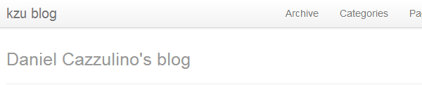



This is where I'll be blogging from now on. No fancy engine. Just plain github + markdown.

It will be pretty bare-bones, yes:

You may try the [Programming]({{ BASE_PATH }}{{ site.tags.programming.url }}) category.